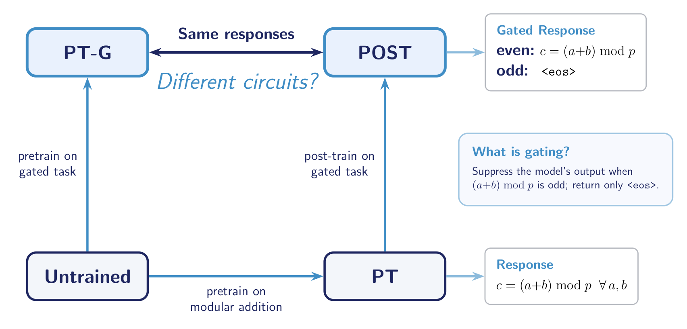
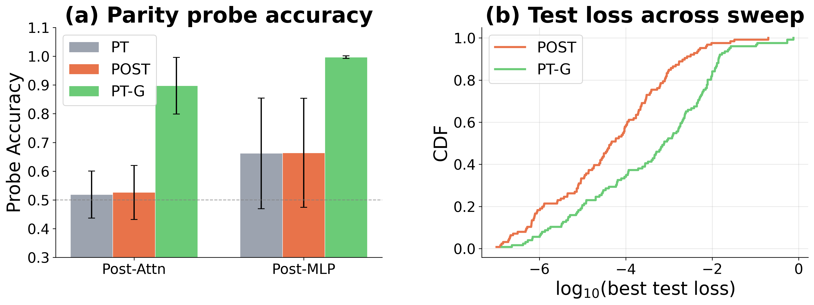
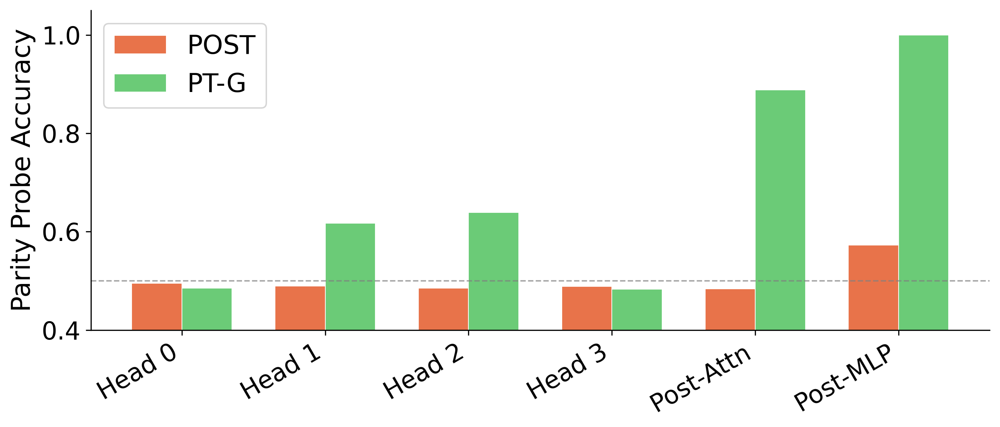

# Do Alignment Pretraining if You Want Your Linear Probes to Work Better ft. Modular Addition

*Karthik Viswanathan, Dmitry Manning-Coe, Adam Shai, Paul Riechers*

**TLDR:** We compare two training procedures that produce identical input-output behavior on parity-gated modular addition: post-training via SFT and pretraining with preferences incorporated into the data distribution. Mechanistic analysis reveals that SFT preserves the pretrained Fourier circuit and modifies only the unembedding layer, while preference-aware pretraining encodes parity throughout the residual stream. Linear probes detect the preference representation in the latter but not the former — with implications for white-box monitoring of alignment in deployed systems.

---

## Introduction

When we fine-tune a model to follow a preference — say, refusing a harmful request — does the model develop a genuine internal representation of that preference, or does it learn a minimal modification at the output layer that leaves the base computation intact?

This question is central to alignment robustness. Mechanistic analysis of fine-tuned models suggests that post-training methods (RLHF, SFT) often produce shallow "wrappers" over pretrained capabilities (Jain et al., 2024) — modifications concentrated at the output projection that could be reversed through further fine-tuning or adversarial perturbation. An alternative is to incorporate preferences directly into the pretraining data distribution (Aydin et al., 2025; Tice et al., 2026), which may produce representations where the preference is structurally entangled with the base computation.

Distinguishing these cases requires mechanistic interpretability, but in frontier models we rarely have sufficient access to the learned algorithm. We therefore study the question in a fully interpretable setting: **one-layer transformers trained on modular addition** over Z₁₁₃, following Nanda et al. (2023). These models learn to compute (a + b) mod 113 via a well-characterized Fourier circuit, and the internal algorithm is fully reverse-engineerable.

We introduce a parity-gated preference: **the model must output the correct answer c = (a + b) mod 113 when c is even, and output `<eos>` (suppressing the answer) when c is odd.** Odd results serve as a toy analogue of unsafe outputs — the model has access to the correct answer but must learn to withhold it.

We compare two routes to this behavior:

- **POST (Post-Trained):** A pretrained modular addition model fine-tuned via SFT on parity-gated data.
- **PT-G (Pretrained-Gated):** A model pretrained from scratch on parity-gated data.

Both achieve near-identical input-output behavior. The question is whether they implement the same internal algorithm.

## Setup

All models use the same 1-layer HookedTransformer architecture (d-model = 128, 4 attention heads, d-mlp = 512, ReLU activation, no LayerNorm) operating on Z₁₁₃. We train three variants on the same train/test split:

- **PT (Pretrained):** Trained on standard modular addition sequences (bos, a, b, =, c, eos) where c = (a + b) mod 113, with next-token prediction loss on the result and eos positions.
- **POST (Post-Trained):** Initialized from the best PT checkpoint and fine-tuned via SFT on parity-gated data — learning to output eos when the result is odd while maintaining correct even answers.
- **PT-G (Pretrained-Gated):** Pretrained from scratch on parity-gated data: even results use the standard format with loss on c and eos; odd results use (bos, a, b, =, eos) with loss on eos only.

We validate all findings across **126 hyperparameter configurations** (3 weight decays x 4 batch sizes x 3 model seeds x 2 split seeds x 2 shuffle seeds, deduplicated for full-batch runs) to ensure they are not artifacts of a single training run.

## Ensemble Results: Parity Encoding and the Alignment Tax

Before examining individual model internals, we establish that our central finding — parity is linearly encoded in PT-G but not POST — holds across the full sweep.

Two findings emerge:

1. **Parity is linearly decodable in PT-G but not in POST or PT.** A logistic regression probe trained on post-attention and post-MLP activations achieves near-perfect accuracy in PT-G but remains at chance (~50%) for POST and PT across all 126 configurations. PT-G encodes parity in its residual stream in a linearly separable manner; POST does not.

2. **POST achieves 1-2 orders of magnitude lower test loss.** POST's loss CDF is shifted left relative to PT-G (median: 4.7e-5 vs 7.8e-4), reflecting the additional difficulty of learning both modular arithmetic and parity gating simultaneously from scratch.

This constitutes a toy analogue of the **safety-capability tradeoff**: post-training preserves raw capability (lower loss) but produces shallow alignment that is not detectable by linear probes. Preference-aware pretraining accepts a capability tax for structurally deeper, probe-detectable alignment.

## Mechanistic Analysis

The ensemble results establish *what* differs between POST and PT-G. We now examine a single canonical model (weight_decay=0.15, batch_size=1024, all three variants at 100% test accuracy) to understand *how* the two variants compute their outputs.

### Residual stream geometry

PCA of the residual stream at the = token position (run over all p² = 12,769 input pairs) reveals a fundamental geometric difference.

In **POST**, the residual stream preserves the Fourier ring geometry inherited from PT — a circular arrangement in PC space where angular position encodes the value of (a + b) mod p, with even and odd points interleaved. SFT has not restructured this geometry.

In **PT-G**, even and odd inputs are separated along the leading principal components at every stage (post-attention through post-MLP). Parity is encoded in the primary axes of variation of the representation.

### Fourier analysis

PT computes modular addition via a well-characterized Fourier circuit (Nanda et al., 2023): the embedding matrix and the neuron-logit map (the composition of the MLP output projection and unembedding) concentrate power on a small set of Fourier frequencies over the cyclic group (frequencies 5, 25, 32 in our canonical model).

**POST preserves PT's spectral structure.** Both the embedding and the neuron-logit map retain the same peak frequencies with attenuated magnitudes. SFT introduces a weak frequency-56 component at the output layer — a minimal parity modification — but does not restructure the Fourier circuit.

**PT-G develops a qualitatively different spectrum.** PT-G allocates substantial power to frequency 56 in both the embedding and the neuron-logit map. Frequency 56 is special: it nearly alternates sign between consecutive integers (since 56/113 is close to 1/2), making it the closest available proxy for a parity signal in this cyclic group. Its presence end-to-end — from embedding through MLP to output logits — confirms that the parity representation propagates through the entire network.

## Linear Probes

To quantify parity encoding beyond PCA, we train logistic regression probes at six network locations — four individual attention head outputs (before the output projection mixes them), the post-attention residual stream, and the post-MLP residual stream — to predict even vs. odd from the =-position activations.

- **PT and POST:** Probe accuracy is at chance (~50%) at every location. Parity is not linearly decodable anywhere in the network — even after SFT on parity-gated data.
- **PT-G:** Parity emerges **progressively**: weak signal in individual attention heads (~62-64%), strengthening substantially after the attention output projection mixes heads into the residual stream (post-attn: 89%), and reaching near-perfect after the MLP (post-MLP: 100%).

This progressive buildup confirms that parity encoding in PT-G is distributed across network components, with the MLP playing a critical role in transforming a weak, distributed signal into a linearly separable one.

## Beyond Linear Probes

The linear probe results suggest POST carries no linearly decodable parity information. However, the PCA geometry tells a more nuanced story: even and odd points in POST trace *interleaved rings* rather than mixing randomly. Parity may be encoded in the manifold geometry — specifically in the radius of the Fourier ring — rather than in a linear direction.

To test this, we construct a **PC-squared augmented probe**: given activations h, we compute the top-k principal components and train logistic regression on the concatenated vector [h; PC1^2, ..., PCk^2] (k=10). This gives the probe access to quadratic features of the dominant directions of variation, enabling it to detect information encoded in the radius of a circular manifold.

- **POST improves substantially with PC-squared augmentation**, especially at post-MLP, where many configurations jump from chance to 0.8-1.0 accuracy. This is consistent with parity being encoded nonlinearly in the Fourier ring geometry — the even/odd distinction lives in the radial coordinate, not a linear direction.
- **PT-G benefits at attention heads**, confirming nonlinear parity encoding early in the network before the MLP sharpens it into a linearly separable representation.

## Discussion

Our mechanistic analysis yields three concrete findings:

1. **POST implements alignment as an output-layer patch.** SFT preserves the pretrained Fourier circuit end-to-end and achieves parity gating by modifying only the output projection and unembedding. The internal computation remains compatible with the pretrained model's output weights.

2. **PT-G integrates the preference throughout the network.** Parity is encoded from the embedding (freq-56) through individual attention heads (PCA separation, probe accuracy above chance) to the post-MLP residual stream (100% linear probe accuracy). The preference is structurally entangled with the base computation.

3. **Linear probes are more effective monitors of alignment-pretrained models.** Parity is linearly decodable in PT-G at every stage past the attention layer, but undetectable by linear probes in POST. PC-squared augmented probes partially close this gap for POST, but the implication is clear: if we want probes to serve as white-box monitors of whether a model has genuinely internalized a preference, alignment pretraining makes the signal far more accessible.

### Limitations

This is a toy setting: one layer, modular addition over a prime field, a binary preference. The Fourier mechanisms are specific to modular arithmetic and will not transfer directly. Real alignment involves richer preference structures, deeper architectures, and more complex training pipelines (RLHF, DPO, constitutional methods). Whether the shallow-vs-deep distinction we observe here has analogues at scale is an empirical question.

### Open questions

- Does SFT produce similarly shallow patches in multi-layer models with richer task structure?
- Can we identify analogues of the alignment tax (capability cost of deeper preference encoding) in larger-scale settings?
- What is the appropriate spectral basis for analyzing models that operate over reduced output vocabularies (e.g., PT-G's even-residue subspace)?

---

## References

- Aydin, E. et al. (2025). "From model training to model raising."
- Jain, S. et al. (2024). "Mechanistically analyzing the effects of fine-tuning on procedurally defined tasks."
- Nanda, N. et al. (2023). "Progress measures for grokking via mechanistic interpretability."
- Tice, T. et al. (2026). "Alignment pretraining: AI discourse causes self-fulfilling (mis)alignment."
